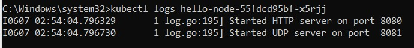
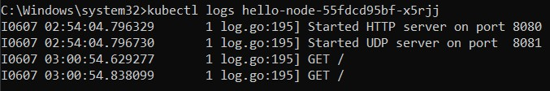

Mochammad Ezar Yudha 2206046746
<h1>Tutorial 11</h1>

<h2>Reflection 1</h2>

<h3>Compare the application logs before and after you exposed it as a Service.</h3>

Before Service

After Service

The log before it was exposed as a service shows that the HTTP server started on port 8080 and the UDP server started on port 8081. The log after it was exposed as a service shows the GET requests being made to the server.

<h3>What is the purpose of the -n option and why did the output not list the pods/services that you
explicitly created?</h3>
The -n option in kubectl get commands specifies the namespace from which to retrieve resources. Namespaces in Kubernetes are a way to divide cluster resources between multiple users or groups of users. By default, Kubernetes resources are created in the default namespace unless otherwise specified.

<h2>Reflection 2</h2>

<h3>What is the difference between Rolling Update and Recreate deployment strategy?</h3>
Rolling Update updates Pods one by one, keeping the app available by only replacing a few at a time. Recreate closes down all Pods before swapping them out, causing a pause in service.

<h3> What do you think are the benefits of using Kubernetes manifest files? Recall your experience
in deploying the app manually and compare it to your experience when deploying the same app
by applying the manifest files (i.e., invoking `kubectl apply -f` command) to the cluster.</h3>
Kubernetes manifest files streamline application deployment by defining the application's setup in a single document. This simplifies the deployment process, automating configuration and ensuring consistency across deployments, compared to manual methods.

